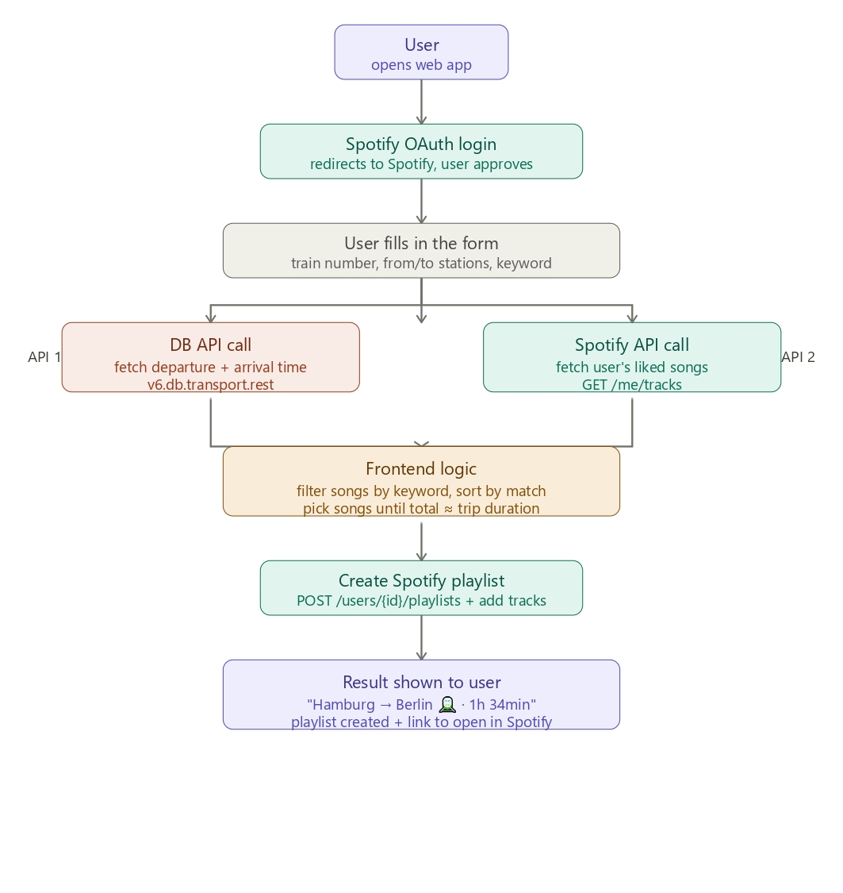

# 🚆🎵 Trainify

A web app that generates a Spotify playlist tailored to the duration of your train journey. Enter your train details, and Trainify picks songs from your liked tracks that fill exactly the travel time.

## User Experience

The user opens the app and is greeted by a single screen with a **"Login with Spotify"** button. After approving access, they land on the main form where they enter three things:

1. A **train connection** (e.g. Hamburg Hbf → Berlin Hbf)
2. A **train number** (e.g. ICE 599)
3. An optional **genre keyword** like "rock" or "chill"

They hit **Generate**, and within a few seconds a new playlist appears in their Spotify — named after the route, already the perfect length for the trip.

## Architecture



## Tech Stack

### Frontend

- **React 19 + Vite** — existing setup
- **TypeScript**
- Plain **CSS** for styling (no UI library needed)

### Backend

- **Node.js + Express** — a small server with just a few endpoints
- Required because Spotify's OAuth flow needs a `client_secret` which must never be exposed in the browser. The backend handles the token exchange securely.

### APIs

| API                    | Purpose                       | Auth                  |
| ---------------------- | ----------------------------- | --------------------- |
| `v6.db.transport.rest` | Journey duration              | None — free, no key   |
| **Spotify Web API**    | Liked songs + create playlist | OAuth 2.0 via backend |

## Backend Endpoints

Three simple routes:

| Method | Route            | Description                                                  |
| ------ | ---------------- | ------------------------------------------------------------ |
| `GET`  | `/auth/login`    | Redirects user to Spotify login page                         |
| `GET`  | `/auth/callback` | Spotify redirects here after login; exchanges code for token |
| `GET`  | `/auth/token`    | Frontend calls this to get the access token                  |

Everything else (DB API call, Spotify liked songs, creating the playlist) is called directly from the React frontend using the access token — no need to proxy through the backend.

## Key Implementation Details

1. **Spotify developer account** — register at [developer.spotify.com](https://developer.spotify.com), get a `client_id` and `client_secret`, set redirect URI to `http://localhost:3000/auth/callback`
2. **Scopes** — `user-library-read` (read liked songs) and `playlist-modify-private` (create playlists)
3. **Duration math** — the DB API returns ISO 8601 timestamps; subtract departure from arrival to get trip minutes, then greedily pick songs until total track duration fills that window
4. **Keyword filtering** — Spotify's liked songs have track name and artist name but not genre tags directly; filter by matching keyword against track/artist names, or optionally call `GET /artists/{id}` to get genre tags

## Getting Started

```bash
# Clone the repo
git clone https://github.com/sophiekeesing/lernfeld-8.git
cd lernfeld-8/frontend

# Install dependencies
npm install

# Start dev server
npm run dev
```

The app will be available at `http://localhost:5173`.

## Project Structure

```
lernfeld-8/
├── frontend/
│   ├── src/
│   │   ├── App.tsx          # Main application component
│   │   ├── main.tsx         # Entry point
│   │   └── assets/          # Images & icons
│   ├── public/
│   ├── index.html
│   ├── vite.config.ts
│   └── package.json
├── backend/                 # Express server (auth endpoints)
├── images/                  # Architecture diagrams
└── README.md
```

## License

See [LICENSE](LICENSE) for details.
