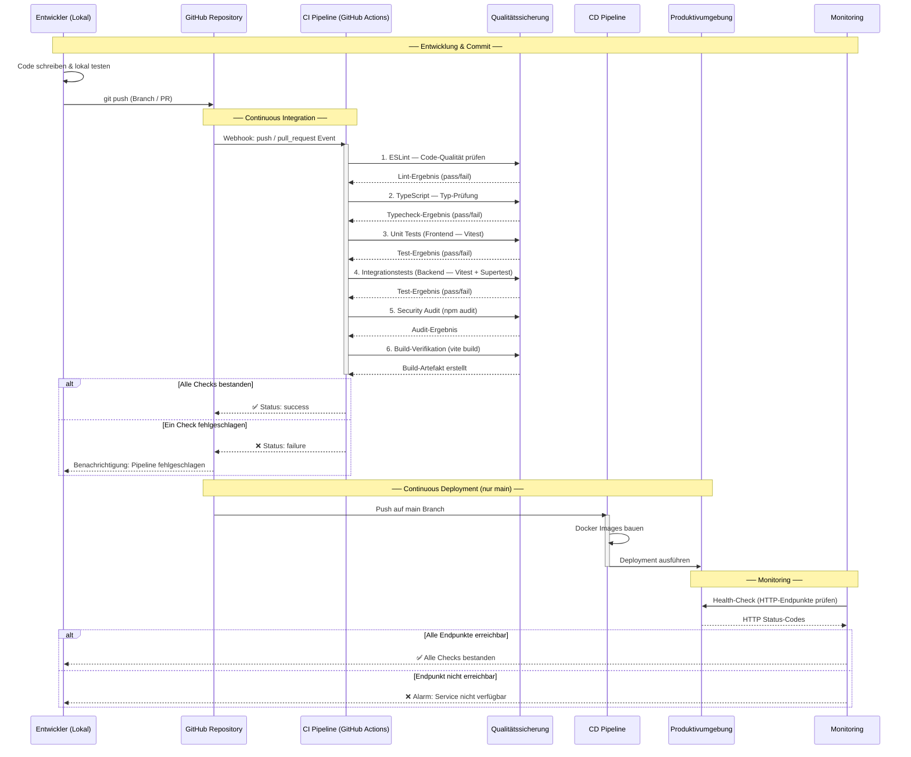

# Trainify CI/CD Pipeline — Sequenzdiagramm

Dieses Dokument beschreibt die CI/CD-Pipeline des Trainify-Projekts als
Sequenzdiagramm. Es zeigt den Ablauf von der lokalen Entwicklung über
Qualitätssicherung bis hin zum Deployment und Monitoring.

## Pipeline-Sequenzdiagramm

## Verwendete Protokolle

| Protokoll           | Verwendung                                             |
| ------------------- | ------------------------------------------------------ |
| **HTTPS**           | GitHub Webhooks, Spotify OAuth 2.0, npm Registry       |
| **HTTP**            | Lokale Entwicklung (Backend ↔ Frontend), Health-Checks |
| **Git (SSH/HTTPS)** | Code-Push an GitHub Repository                         |
| **OAuth 2.0**       | Spotify-Authentifizierung (Authorization Code Flow)    |
| **REST/JSON**       | Backend-API (Express), Spotify Web API, DB HAFAS API   |

## Qualitätssicherungsmaßnahmen

1. **ESLint** — Statische Code-Analyse und Stilprüfung
2. **TypeScript Type-Checking** — Typensicherheit zur Kompilierzeit
3. **Unit Tests** — Vitest + React Testing Library (Frontend-Logik & Komponenten)
4. **Integrationstests** — Vitest + Supertest (Backend-API-Routen)
5. **Security Audit** — npm audit auf bekannte Schwachstellen
6. **Build-Verifikation** — Sicherstellen, dass das Projekt kompiliert
